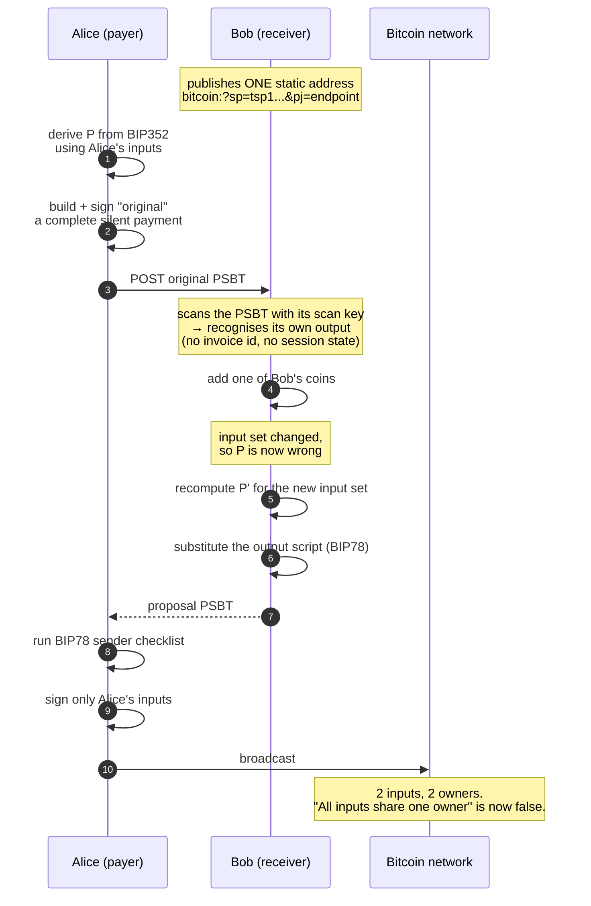
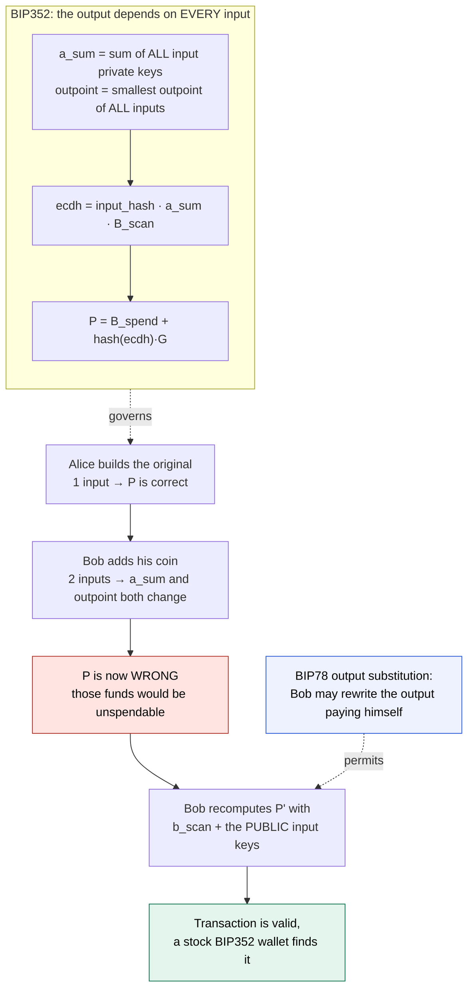
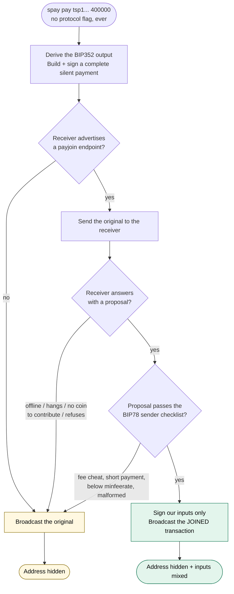
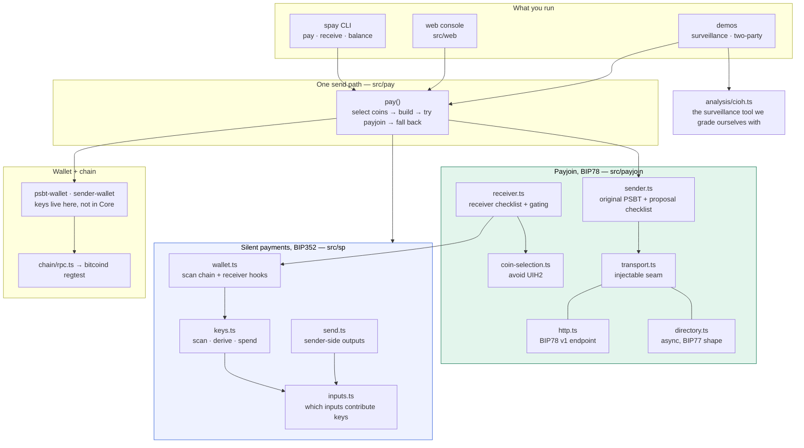

# Silent Payjoin

**A Bitcoin payment that breaks the heuristic chain surveillance runs on — and it is what happens
by default, not a setting you remember to switch on.**

Built for the **Bitshala BOSS Battle** hackathon, **Cypherpunk** track.
[Design write-up](docs/design.md) · [Limitations](docs/limitations.md) · [Submission copy](docs/submission.md) · [Demo script](docs/demo-script.md)

---

## The gap this fills

Thirty-seven projects were submitted to this hackathon. We pulled the full list from Devfolio's API
and keyword-scanned every name, tagline, description and tag for *payjoin, coinjoin, coinswap,
bip78, bip352, mixing* and a dozen related terms.

> **Six teams built tools that score or visualise your Bitcoin privacy. Zero built a mechanism that
> changes it.** The single keyword hit was a project that *detects* the common-input-ownership
> heuristic.

Measuring the problem is not fixing it. This is a mechanism.

---

## What it does

Every Bitcoin payment leaks two things:

| Leak | Why it happens | Fixed by |
|---|---|---|
| **Who you paid** | addresses get reused, so every payment to a merchant links up | **BIP352 silent payments** — one static address, a fresh on-chain key per payment |
| **Which coins are yours** | the *common-input-ownership heuristic*: all inputs in a transaction are assumed to share one owner | **BIP78 payjoin** — the receiver contributes a coin, so they don't |

This project does both, in one transaction.



Step 4 is worth pausing on: the receiver figures out which output pays it **by scanning the sender's
PSBT with its scan key** — the same operation it would run on a chain transaction. No invoice
identifier, no database, no session. The cryptography *is* the addressing, which is what makes a
single static address workable for a payjoin receiver.

---

## Why the two don't obviously compose

This is the technically interesting part, and the reason it isn't already done.



The resolution needs no change to either BIP. The receiver can recompute because the ECDH secret is
symmetric — `b_scan·(input_hash·A_sum)` equals `input_hash·a_sum·B_scan` — and the receiver's route
needs only its own scan key plus the **public** input keys, which are all in the PSBT.

The sender's route needs the **private** keys of every input, including the receiver's, which it
will never have. That asymmetry is why only the receiver can do it — and it is also the
composition's one genuine cost, written up honestly in
[docs/design.md](docs/design.md#what-the-sender-cannot-check).

---

## Private by default

There is no privacy flag. The same command handles every case; only the outcome differs.



**Every fallback is still a silent payment.** The worst case is private addressing without the join —
never a reused address. That is the difference between "privacy is available" and "privacy is the
default", which is the bar this track actually sets.

---

## Does it work? Here is the evidence

```bash
./infra/regtest.sh start
npm run demo:surveillance
```

It builds **three real transactions on a regtest chain** — the same 600,000 sat payment, three ways —
then points a chain-surveillance tool at each and marks its answers against ground truth, because we
hold the keys.

| Question the analyst asks | TODAY<br/>*reused address* | + SILENT PAYMENTS<br/>*fresh key* | + PAYJOIN<br/>*fresh key + joined inputs* |
|---|:---:|:---:|:---:|
| Who received this money? | ✓ correct | ✗ wrong | ✗ wrong |
| Who owns the inputs? | ✓ correct | ✓ correct | **✗ wrong** |
| How much was paid? | ✓ correct | ✓ correct | **✗ wrong** |
| **Surveillance score** | **3/3** | **2/3** | **0/3** |

The middle column is the argument. Silent payments alone remove the address but leave the payer
clustered and the amount public — **both halves are load-bearing**. The demo also writes
`out/report.html`, the same comparison as a page for slides.

> **Stated precisely:** these three textbook heuristics return wrong answers. This is not a
> commercial analysis product with clustering history or exchange data, and an analyst who *suspects*
> payjoin can subtract the receiver's contribution to recover the amount. The durable claim is that
> the shared-ownership assumption becomes unreliable everywhere, not that one transaction is
> undetectable. More in [docs/limitations.md](docs/limitations.md).

---

## Run it yourself

```bash
./infra/regtest.sh start     # a dedicated regtest node, its own datadir and port

npm run web                  # console at http://127.0.0.1:8080 — click Fund, then Pay, twice
npm run demo:surveillance    # the before/after table above
npm run demo:two-party       # two independent processes: a join, then a graceful fallback
npm test                     # 152 tests
```

**In the web console:** press **Pay** once and it falls back (the receiver has no coin to contribute
yet); press it again and it joins. Flip the payjoin toggle off and press Pay a third time — same
button, still private, no join. Each payment card shows the inputs with their true owners and what
the analyst concludes.

Or the CLI, as two people would use it:

```bash
npm run spay -- receive               # terminal 1: prints a static address + payjoin URI
npm run spay -- pay '<uri>' 400000    # terminal 2: no flags, ever
```

---

## How it is built

TypeScript throughout, five runtime dependencies, keys held in the application (BIP352 derivation
needs the sender's input private keys, so Bitcoin Core is only the chain backend).



Two design decisions worth flagging to a reviewer:

- **The transport is a seam.** BIP77 (payjoin v2) replaces the receiver-hosted endpoint with a
  directory both sides poll — and its spec defines the receiver and sender checklists as *"the same
  as BIP 78"*. So the silent-payment layer ports unchanged. We prove that rather than assert it: the
  identical flow runs over an async directory with **the receiver hosting nothing**
  (`src/payjoin/transport-async.ts`). What is *not* implemented — HPKE, ElligatorSwift, OHTTP — is
  itemised in [docs/design.md](docs/design.md#porting-to-bip77), and a test asserts that our stand-in
  directory sees plaintext, so the gap can't be overlooked.
- **The receiver's coin choice is deliberate.** Contributing the largest coin makes a payjoin
  obvious. It contributes the *smallest coin that still exceeds the sender's change*, which keeps the
  transaction in the ordinary-payment shape (avoiding **UIH2**, Ghesmati et al. 2022) while exposing
  as little of the wallet as possible.

---

## What we verified

| | |
|---|---|
| **152 tests**, 0 skipped | run `npm test` |
| **BIP78 conformance** | the sender reproduces the BIP's own test vectors **byte-for-byte** |
| **BIP352 conformance** | all **28** official send/receive vectors pass through our derivation layer |
| **17 failure modes** | offline, hangs, no coin, fee cheating, replay, reentrancy, probing, double-spend — each ends in a completed payment |
| **Live chain** | every end-to-end test builds, signs, broadcasts and mines on regtest |

We also found a real bug in **Bitshala's own `@silent-pay/core`**: its secp256k1 backend mutates
private keys in place, so `scanOutputs()` corrupts the caller's scan key — a wallet finds its first
payment and then never another, silently. Worked around with defensive copies and pinned by a
regression test; to be reported upstream.

---

## Honest limitations

Read [docs/limitations.md](docs/limitations.md) before judging what this claims. The short version:
**regtest only**, keys are stored unencrypted, the chain scan walks every block and ignores reorgs,
the web console is untested glue, BIP77 is demonstrated in shape but not implemented, and a
silent-payment payjoin requires output substitution that **the sender cannot cryptographically
verify** — with a proposed fix sketched but not built.

The library this builds on says it is experimental. So is this.

---

## Documentation

| Document | What's in it |
|---|---|
| [docs/design.md](docs/design.md) | The composition as a spec: the obstruction, the mechanism, the asymmetry, the BIP77 port, prior-art status |
| [docs/limitations.md](docs/limitations.md) | Thirteen known gaps, each with why it's there and what closing it takes |
| [docs/phase-0.md](docs/phase-0.md) … [phase-6.md](docs/phase-6.md) | Build log: what was made, tested and found at each stage |
| [docs/submission.md](docs/submission.md) | Devfolio copy |
| [docs/demo-script.md](docs/demo-script.md) | 90-second video script, shot by shot |

## Layout

```
infra/regtest.sh          dedicated regtest bitcoind (own datadir, port 18543)
src/sp/                   BIP352: input rules, keys, scanning, sender outputs, receiver wallet
src/payjoin/              BIP78: sender, receiver, coin selection, transports, directory
src/pay/                  the one send path
src/wallet/               keys, PSBT build/sign, coin selection, persistence
src/analysis/             the surveillance tool used to grade ourselves
src/web/                  demo console
scripts/                  the demos
```

MIT licensed. Regtest only — do not point this at mainnet.
